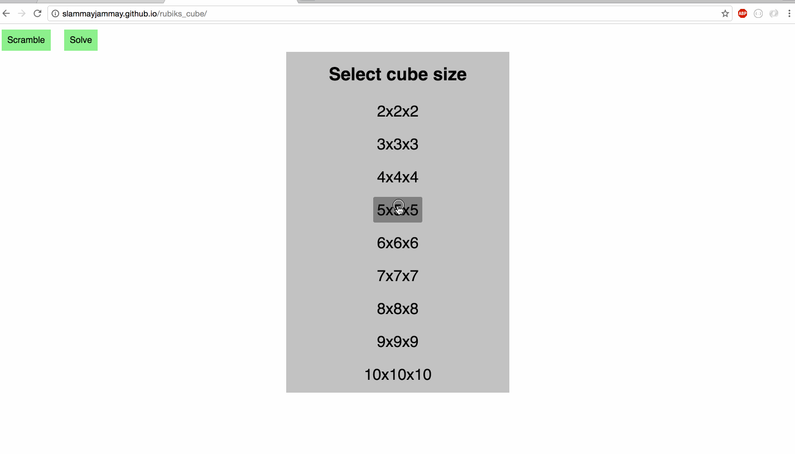

# Rubik's Cube ([link](https://slammayjammay.github.io/rubiks_cube/))
_Inspired by the original game at http://hi-games.net/cube/_

## New and Improved!
- Mega-Ultra-Smooth performance!
- Click and drag!
- Trendy ES6+ syntax like `import`, `async` and `await`!
- NPM and Rollup!
- No more jQuery!

## Sizes!

## Scramble!

## Solve!

