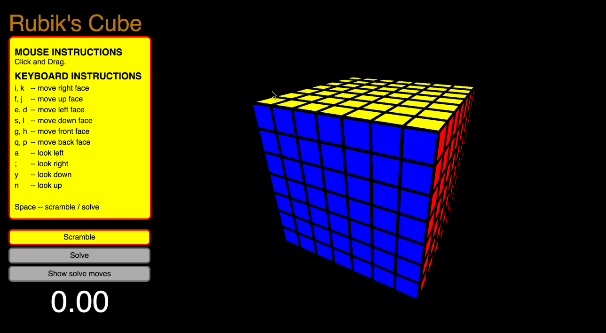
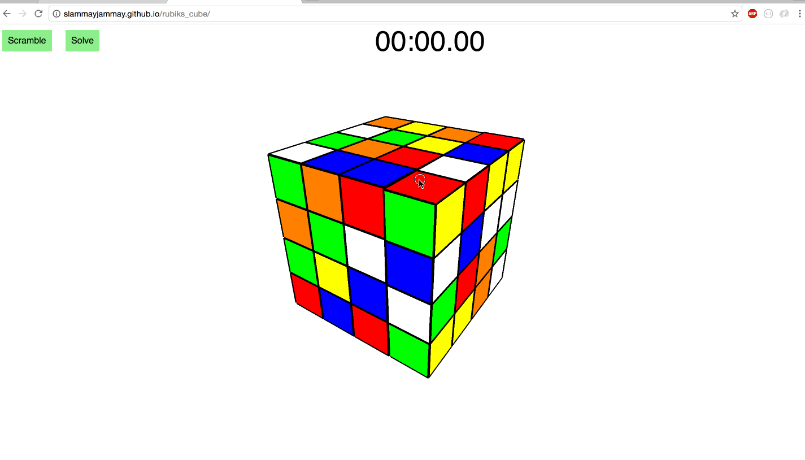

# Rubik's cube ([live](http://scott-mck.github.io/rubiks_cube/))
Inspired by the original game at http://hi-games.net/cube/

## Demos

## Features
* Offers choice of cube size ranging from 2x2x2 to 9x9x9
* Move faces using mouse or keyboard
* Offers scrambling and timing
* Offers solve move hints for you to solve it yourself
* Offers auto-solve for any given scramble
* Offers an example of me solving it as I would in real life (for 3x3x3)
